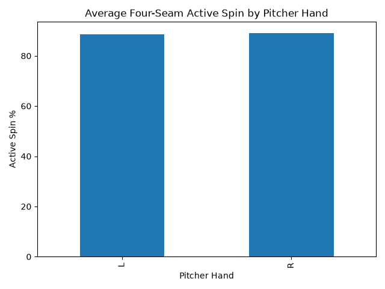
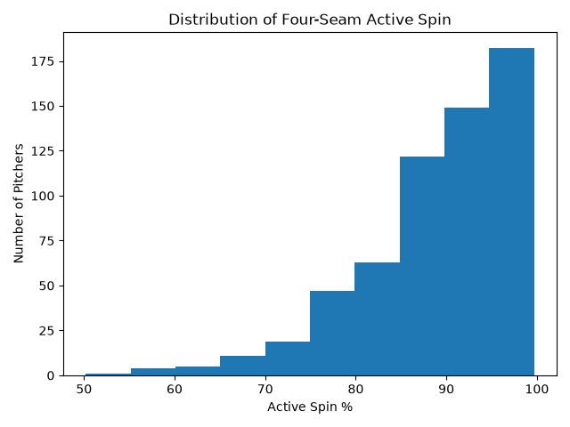

# baseball-pitching-analysis
Python analysis of baseball pitching data, including four-seam fastball active spin and pitcher handedness.

## Questions

- What is the average four-seam active spin percentage?
- Do left-handed and right-handed pitchers have different average active spin?
- Which pitchers have the highest active spin?
- Which pitchers have active spin below 85%?

## Tools

- Python
- pandas
- Matplotlib

## Results

- The average four-seam active spin percentage was approximately **89.0%**.
- Right-handed pitchers averaged **89.14%** active spin.
- Left-handed pitchers averaged **88.64%** active spin.
- The difference between right-handed and left-handed pitchers was only about **0.50 percentage points**.
- There were **603 pitchers** with four-seam active spin data.
- **154 pitchers** had active spin below 85%, which is about **25.5%** of the sample.
- Kyle Finnegan had the highest four-seam active spin in the dataset at **99.7%**.

### Interpretation

The data shows that pitcher handedness had very little relationship with average four-seam active spin in this dataset. Right-handed pitchers had a slightly higher average, but the difference was small.

## Visualizations

### Average Four-Seam Active Spin by Pitcher Hand

### Distribution of Four-Seam Active Spin

